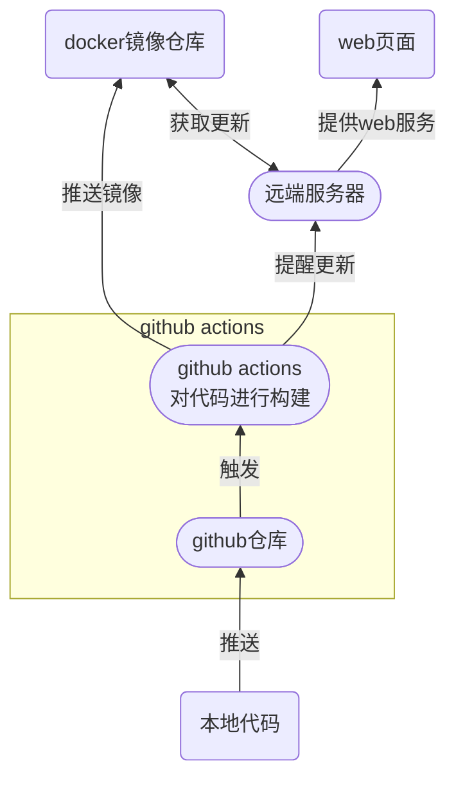

::: warning 施工中
:::

## 技术选型
- markdown
- vuepress
- Github actions
- Docker
- 阿里云轻量级服务器

## 思路
博客文档部分采用 `markdown` 进行编写，将github仓库作为我们的文章数据源，使用 `vuepress` 对文章进行静态文件编译，借助 `Github actions` 将编译好的静态文件作为镜像推送到`Docke Hub`上，推送成功后`Github actions`通知云服务器进行`Docke`更新，云服务器将更新后的`Docker 镜像`做为容器运行并提供web服务

::: tip 疑问
为什么选择 markdown？
- 拜托！markdown真的超好用的好吧，我真的爱死mardown了_(:з」∠)_

采用vuepress编译为静态文件的好处
- 首先我们只编写 `markdown` 文件并 push 到git远端库上，这样保证了我们文档笔记的安全性，你也不想你写了很久的笔记因为服务器到期或者其他原因突然离你而去对吧？而且这样我们不用考虑后端交互，只专注于 `markdown` 文档编写,`vuepress`会帮我搞定一切
- 并且因为最终编译为静态文件这便于了我们网站在SEO方面的优化，最后我们只要配置好我们的`Github actions`我们就可以很方便的对我们的博客内容进行推送

为什么不直接通过scp将静态文件推送到云服务上？
- 我想你也跟我一样，会担心某天想更换一个服务商，导致我们要更换服务器，这时我们的服务变更导致的重装系统时，我们往往需要根据不同的服务器进行环境配置，这使得我们的系统迁移变得很笨重，如果我们将系统打包成为`Docker镜像`，我们就只需要想下载软件一样`安装Docker`并运行就好了
:::
