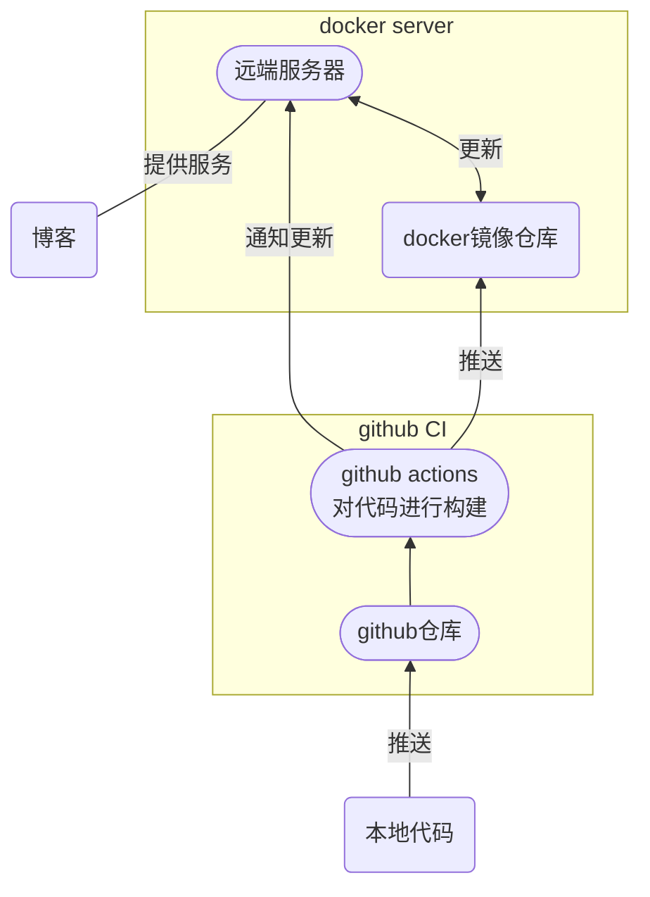

思路：

```mermaid
flowchart BT
  local(本地代码)-->|推送|github([github仓库])
  web(博客)---|提供服务|server([远端服务器])
  subgraph githubServer [github CI]
    direction LR
    github-->githubIC([github actions\n对代码进行构建])

    end
  githubIC-->|通知更新|server
  githubIC-->|推送|docker(docker镜像仓库)
  subgraph dockerServer [docker server]
    direction LR
    docker<-->|更新|server
    end
```

